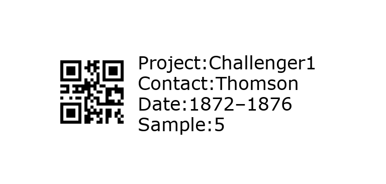

 

# Labelmaker

Make printable QR code labels for samples using basic information about a project. 

## Installation

Labelmaker requires the following software:

* Conda
* Tex Live
* Labelmaker (this repository)

### Conda

If you don't have Conda installed on your machine, install [Miniconda](https://conda.io/miniconda.html) for your operating system (Python 3.7+ version).

Create a conda environment called `labels` where you will install the package [`qrcode`](https://pypi.org/project/qrcode/):

```
conda create -n labels pandas click python=3
source activate labels
pip install qrcode[pil]
```

### TeX Live

Tex Live provides a comprehensive TeX system with binaries for macOS, Linux, and Windows; you can download it [here](https://tug.org/texlive/). We will use `lualatex`. A TeX installation is not absolutely required, but it is required to render a label sheet (PDF) from the individual label image files (PNG).

### Labelmaker

Clone the Labelmaker repository to your computer:

```
git clone https://github.com/cuttlefishh/labelmaker
cd labelmaker
```

## Execution

Make a sheet of labels in three easy steps:

1. Generate the labels as PNG files.
2. Generate a composite sheet of labels as a PDF file.
3. Print!

### Step 1: Generate individual labels (PNG)

Run the command `generate_labels.py` with the required parameters. To learn more about each parameter, run `./generate_labels.py --help`. Two options for sample names are available:

#### Option 1: Provide a list of samples

If a list of sample names is provided, those sample names are used, and replicate labels are produced from 1 to *N*, where *N* is the specified number of replicates per sample.

```
./generate_labels.py \
  --project Project1 \
  --contact MySurname \
  --sample_type DNA_0.2um \
  --date 180929 \
  --sample_list sample_list.txt \
  --num_replicates 2
```

#### Option 2: Number sequentially

If no list of sample names is provided, samples are named from 1 to *M*, where *M* is the specified number of samples, and replicate labels are produced from 1 to *N*, where *N* is the specified number of replicates per sample.

```
./generate_labels.py \
  --project Project2 \
  --contact MySurname \
  --sample_type DNA_0.2um \
  --date 180929 \
  --num_samples 5 \
  --num_replicates 2
```

### Step 2: Generate label sheet (PDF)

Labelmaker produces label sheets intended to be printed on Cryo-Babies labels with part number LCRY-1700 ([Diversified Biotech](https://www.divbio.com/product/lcry-1700)). These are 1.28-inch x 0.5-inch labels in a grid of 5 x 17 labels. 

*Note: Although the physical labels are 1.28 x 0.5 inches, the Python code and TeX code are calibrated for labels with size 1.05 x 0.5 inches or an aspect ratio of 2.1:1 (width:height). By default, `generate_labels.py` will produce PNG files with dimensions 1.05 x 0.5 inches. The user should not change these defaults if they intend to use the commands below to generate label sheets.*

Run `lualatex` from the directory containing the PNG files and TEX file using the commands below.

```
cd /PATH/TO/labelmaker/labels_Project1
lualatex labelsheet_Project1_LCRY1700.tex

cd /PATH/TO/labelmaker/labels_Project2
lualatex labelsheet_Project2_LCRY1700.tex
```

### Step 3: Print

Now just open up the resulting PDF file (e.g., `labelsheet_Project1_LCRY1700.pdf`) and print on a sheet of Cryo-Babies LCRY-1700 labels.
