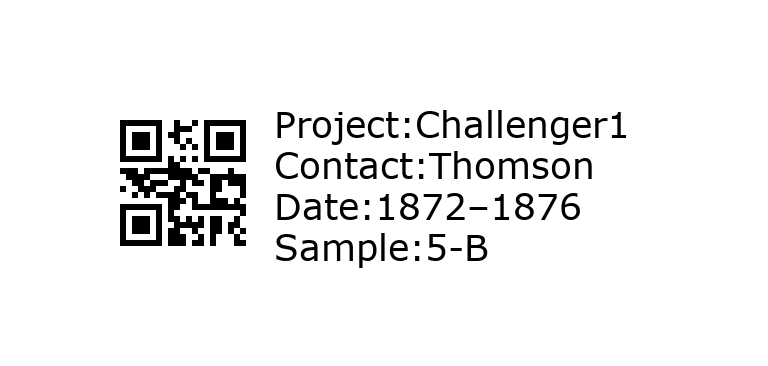

# Labelmaker

Make printable QR code labels for samples using basic information about a project. 

## Installation

### Option 1: Native install

Labelmaker has been tested on macOS and Linux. It requires the following software:

* Conda
* TeX Live
* Labelmaker (this repository)

#### Conda

If you don't have Conda installed on your machine, install [Miniconda](https://conda.io/miniconda.html) for your operating system (Python 3.7+ version).

Create a conda environment called `labels` where you will install the package [`qrcode`](https://pypi.org/project/qrcode/):

```
conda create -n labels pandas click python=3
source activate labels
pip install qrcode[pil]
```

#### TeX Live

Tex Live provides a comprehensive TeX system with binaries for macOS, Linux, and Windows; you can download it [here](https://tug.org/texlive/). We will use `lualatex`. A TeX installation is not absolutely required, but it is required to render a label sheet (PDF) from the individual label image files (PNG).

#### Labelmaker

Clone the Labelmaker repository to your computer:

```
git clone https://github.com/aomlomics/labelmaker
cd labelmaker
```

### Option 2: Docker container

To run Labelmaker inside a Docker container:

1. Install Docker Desktop (Mac, Windows, or Linux) from [Docker.com](https://docs.docker.com/get-docker/).
2. Open Docker app.
3. Download the Docker image from [DockerHub](https://hub.docker.com/r/aomlomics/labelmaker) (command below).
4. Run the Docker image (command below).

```bash
docker pull aomlomics/labelmaker
docker run -v $HOME:/data -it aomlomics/labelmaker
```

If installing on a Mac with an Apple Silicon chip, run the Docker image with the `--platform linux/amd64` command. It will take a few minutes for the image to load the first time it is run.

```bash
docker run --platform linux/amd64 -v $HOME:/data -it aomlomics/labelmaker
```

The `-v` (volume) flag above allows you to mount a local file system volume (in this case your home directory) to read/write from your container. Note that symbolic links in a mounted volume will not work.

## Execution

Make a sheet of labels in three easy steps:

1. Generate the labels as PNG files.
2. Generate a composite sheet of labels as a PDF file.
3. Print!

### Step 1: Generate individual labels (PNG)

Run the command `generate_labels.py` with the required parameters. To learn more about each parameter, run `./generate_labels.py --help`. Two options for sample names are available:

#### Option 1: Provide a list of samples

If a list of sample names is provided, those sample names are used. The sample list should be provided as a text file with one sample name per line (no spaces). If the number of replicates *N* is greater than 1 (default), replicate labels are produced from 1 to *N*.

```
./generate_labels.py \
  --project ProjectX \
  --contact MySurname \
  --date 180929 \
  --sample_list sample_list.txt \
  --num_replicates 1 \
  --separator '_'
```

#### Option 2: Number sequentially

If no list of sample names is provided, samples are named from 1 to *M*, where *M* is the specified number of samples. If the number of replicates *N* is greater than 1 (default), replicate labels are produced from 1 to *N*.

```
./generate_labels.py \
  --project Challenger1 \
  --contact Thomson \
  --date 1872–1876 \
  --num_samples 5 \
  --num_replicates 2
```

### Step 2: Generate label sheet (PDF)

Labelmaker produces letter size PDF files intended to be printed on Cryo-Babies label sheets, part number [LCRY-1700](https://www.divbio.com/product/lcry-1700) (Diversified Biotech). These are 1.28-inch x 0.5-inch labels in a grid of 5 x 17 labels.<sup>[1](#footnote1)</sup>

Label sheets are generated from TeX files using `lualatex`. If the number of samples including replicates exceeds 85 (the number of labels per sheet), multiple TeX files will be produced and should be converted to PDF.

Run `lualatex` from the directory containing the PNG files and TeX file using the commands below.

```
cd /PATH/TO/labelmaker/labels_Project1
lualatex labelsheet1_Project1_LCRY1700.tex

cd /PATH/TO/labelmaker/labels_Project2
lualatex labelsheet1_Project2_LCRY1700.tex
```

### Step 3: Print

Open the resulting PDF file (e.g., `labelsheet1_Project1_LCRY1700.pdf`) and print on a sheet of Cryo-Babies LCRY-1700 labels.

Example:

 

---

<sup><a name="footnote1">1</a></sup> Although the physical labels are 1.28 x 0.5 inches, the Python code and TeX code are calibrated for labels with size 1.05 x 0.5 inches or an aspect ratio of 2.1:1 (width:height). By default, `generate_labels.py` will produce PNG files with dimensions 1.05 x 0.5 inches. The user should not change these defaults if they intend to use the commands below to generate label sheets.

## Disclaimer

This repository is a scientific product and is not official communication of the National Oceanic and Atmospheric Administration, or the United States Department of Commerce. All NOAA GitHub project code is provided on an ‘as is’ basis and the user assumes responsibility for its use. Any claims against the Department of Commerce or Department of Commerce bureaus stemming from the use of this GitHub project will be governed by all applicable Federal law. Any reference to specific commercial products, processes, or services by service mark, trademark, manufacturer, or otherwise, does not constitute or imply their endorsement, recommendation or favoring by the Department of Commerce. The Department of Commerce seal and logo, or the seal and logo of a DOC bureau, shall not be used in any manner to imply endorsement of any commercial product or activity by DOC or the United States Government.
